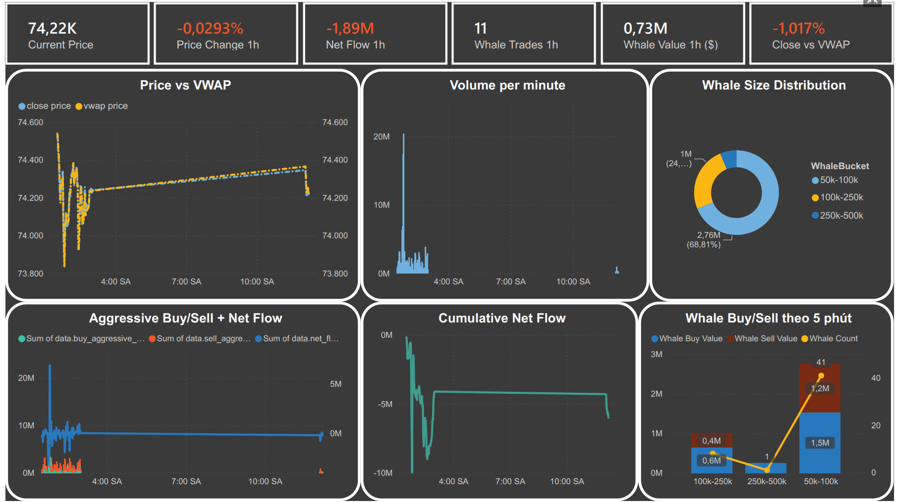

<div align="center">

# Real-Time Crypto Data Lakehouse

### Nền tảng dữ liệu hợp nhất Batch & Streaming cho tín hiệu giao dịch crypto

[](https://spark.apache.org/)
[](https://kafka.apache.org/)
[](https://delta.io/)
[](https://min.io/)
[](https://www.docker.com/)
[](https://www.prefect.io/)
[](LICENSE)

_Hệ thống Data Lakehouse 5 lớp xử lý ~15 GB dữ liệu Bitcoin lịch sử và luồng real-time từ Binance, phục vụ tín hiệu hỗ trợ giao dịch ngắn hạn (net flow, VWAP, whale alert)._

</div>

<br>

## Mục lục

- [Giới thiệu](#-giới-thiệu)
- [Kiến trúc hệ thống](#-kiến-trúc-hệ-thống)
- [Medallion Architecture](#-medallion-architecture)
- [ACID & Time Travel](#-acid--time-travel-với-delta-lake)
- [Công nghệ sử dụng](#-công-nghệ-sử-dụng)
- [Cấu trúc thư mục](#-cấu-trúc-thư-mục)
- [Cài đặt & khởi chạy](#-cài-đặt--khởi-chạy)
- [Kết nối Power BI](#-kết-nối-power-bi)
- [Kết quả đạt được](#-kết-quả-đạt-được)
- [Giấy phép](#-giấy-phép)

---

## Giới thiệu

Dự án xây dựng một hệ thống **Data Lakehouse** hoàn chỉnh — kết hợp ưu điểm của Data Lake (lưu trữ linh hoạt, chi phí thấp) và Data Warehouse (schema rõ ràng, truy vấn nhanh) — để xử lý dữ liệu giao dịch Bitcoin (BTC/USDT) và sinh ra các **tín hiệu hỗ trợ ra quyết định giao dịch ngắn hạn**.

> **Bài toán nghiệp vụ:** Trader cá nhân/tổ chức cần chỉ báo nhanh về áp lực mua–bán (Net Flow) và mức giá hợp lý (VWAP) để quyết định vào/thoát lệnh, cùng cảnh báo sớm các giao dịch bất thường (whale trade) có thể gây biến động giá đột ngột.

### Mục tiêu chính

|  #  | Mục tiêu                   | Mô tả                                                                                                                               |
| :-: | -------------------------- | ----------------------------------------------------------------------------------------------------------------------------------- |
|  1  | **Unified Pipeline**       | Một pipeline xử lý cả **Batch** (dữ liệu lịch sử) và **Streaming** (real-time từ Binance), không cần lớp Raw trung gian riêng biệt. |
|  2  | **Medallion Architecture** | 3 tầng chất lượng dữ liệu tăng dần: **Bronze → Silver → Gold**.                                                                     |
|  3  | **ACID Compliance**        | Đảm bảo toàn vẹn dữ liệu bằng **Delta Lake** (Atomicity, Consistency, Isolation, Durability).                                       |
|  4  | **Modern Infra**           | Điều phối bằng **Prefect 2.x**, đóng gói toàn bộ bằng **Docker Compose**, triển khai một lệnh.                                      |

### Nguồn dữ liệu

| Loại      | Nguồn                 | Mô tả                                        | Khối lượng |
| --------- | --------------------- | -------------------------------------------- | ---------- |
| Batch     | BTC Tick-Data CSV     | Dữ liệu giao dịch lịch sử BTC/USDT theo tick | ~15 GB     |
| Streaming | Binance WebSocket API | Luồng giao dịch real-time `btcusdt@aggTrade` | Liên tục   |

---

## Kiến trúc hệ thống

Hệ thống thiết kế theo mô hình **5 lớp**, mỗi lớp đảm nhận một chức năng riêng biệt:

```
┌──────────────────────────────────────────────────────────────┐
│                    CRYPTO DATA LAKEHOUSE                     │
├──────────────────────────────────────────────────────────────┤
│                                                              │
│  LỚP 5 · CONSUMPTION                                         │
│  ┌────────────────────────────────────────────────────────┐  │
│  │  Power BI Dashboard  ·  REST API  ·  Trino / DBeaver   │  │
│  └───────────────────────────┬────────────────────────────┘  │
│                              │                               │
│                              ▼                               │
│  LỚP 4 · COMPUTE & ORCHESTRATION                             │
│  ┌────────────────────────────────────────────────────────┐  │
│  │  Apache Spark (Batch + Structured Streaming)           │  │
│  │  Prefect 2.x (lịch chạy, giám sát, restart tự động)    │  │
│  └───────────────────────────┬────────────────────────────┘  │
│                              │                               │
                               ▼                               │
│  LỚP 3 · METADATA                                            │
│  ┌────────────────────────────────────────────────────────┐  │
│  │  Delta Lake — Transaction Log · Time Travel · Schema   │  │
│  │  Evolution · ACID Transactions                         │  │
│  └───────────────────────────┬────────────────────────────┘  │
│                              │                               │
│                              ▼                               │
│  LỚP 2 · STORAGE                                             │
│  ┌────────────────────────────────────────────────────────┐  │
│  │  MinIO (S3-compatible)                                 │  │
│  │  Bronze (Raw) → Silver (Clean) → Gold (Aggregated)     │  │
│  └───────────────────────────┬────────────────────────────┘  │
│                              │                               │
│                              ▼                               │
│  LỚP 1 · INGESTION                                           │
│  ┌────────────────────────────────────────────────────────┐  │
│  │  Batch: CSV volume mount   ·   Stream: Binance → Kafka │  │
│  └────────────────────────────────────────────────────────┘  │
│                                                              │
└──────────────────────────────────────────────────────────────┘
```

<details>
<summary><b>Chi tiết từng lớp</b> (nhấn để mở rộng)</summary>

<br>

**Lớp 1 — Ingestion (Nạp dữ liệu)**

- Batch: dữ liệu CSV tĩnh, mount trực tiếp từ ổ đĩa local (`infra/workspace/*.csv`).
- Streaming: script Python đọc WebSocket Binance, đẩy qua Kafka topic `binance_trades`.

**Lớp 2 — Storage (Lưu trữ Medallion)**

- `all_crypto_trades` (Bronze): dữ liệu thô, hợp nhất cả 2 luồng Batch & Kafka JSON.
- `btc_trades` (Silver): đã tách cột, chuẩn hóa schema, lọc dữ liệu rác.
- Gold: dữ liệu đã tổng hợp, sẵn sàng cho báo cáo/BI.

**Lớp 3 — Metadata (Delta Lake)**

- Schema Evolution: khi Kafka gửi thêm trường JSON mới, Delta tự mở rộng cột mà không phá vỡ bảng CSV đã có.
- Quản lý phiên bản checkpoint streaming và lịch sử transaction log.

**Lớp 4 — Compute & Orchestration (Spark & Prefect)**

- Spark Structured Streaming chạy 24/7, đọc trực tiếp từ Bronze để tinh lọc ra Silver.
- Prefect điều phối các Flow tự động, gồm cả giám sát và khởi động lại container khi cần.

</details>

---

## Medallion Architecture

```
   CSV / Kafka
        │
        ▼
  ┌──────────┐   Spark    ┌──────────┐   Spark    ┌──────────┐
  │  BRONZE  │ ─────────► │  SILVER  │ ─────────► │   GOLD   │
  │ (Unified)│  Streaming │ (Clean)  │   Batch    │  (Agg)   │
  └──────────┘            └──────────┘            └──────────┘
   Batch & Stream           Đã chuẩn hóa            Sẵn sàng
   hợp nhất 1 bảng           & làm sạch             phân tích
```

| Tầng       | Vai trò                                                                                                                                             |
| ---------- | --------------------------------------------------------------------------------------------------------------------------------------------------- |
| **Bronze** | Spark đọc thẳng CSV local và nối luồng Kafka vào chung một bảng duy nhất (`all_crypto_trades`) nhờ Schema Evolution — không cần lớp Raw trung gian. |
| **Silver** | Spark Streaming 24/7 theo dõi bảng Bronze, parse JSON và cột CSV song song, chuẩn hóa timestamp, xuất ra bảng sạch `btc_trades`.                    |
| **Gold**   | Dữ liệu tổng hợp theo thời gian (OHLCV, VWAP, Net Flow, Whale Alert), phục vụ trực tiếp cho dashboard và API.                                       |

**Vì sao chọn kiến trúc hợp nhất này:**

1. **Hiệu suất** — bỏ bước trung chuyển qua Raw layer riêng, giảm nghẽn I/O.
2. **Unified Data** — gộp cả Batch và Stream vào một bảng Bronze duy nhất, kiến trúc gọn hơn.
3. **Data Quality** — mỗi tầng thêm một lớp kiểm tra chất lượng, tăng dần độ tin cậy.

---

## ACID & Time Travel với Delta Lake

| Tính chất       | Áp dụng trong dự án                                                           |
| --------------- | ----------------------------------------------------------------------------- |
| **A**tomicity   | Ghi xuống MinIO thành công toàn bộ hoặc không tạo file rác.                   |
| **C**onsistency | Schema được enforce chặt; Evolution chỉ cho phép khi khai báo rõ ràng.        |
| **I**solation   | Batch và Streaming cùng ghi APPEND song song trên một bảng mà không xung đột. |
| **D**urability  | Transaction log lưu bền vững trong `_delta_log/`.                             |

---

## Công nghệ sử dụng

| Lớp           | Công nghệ            | File / Code                      | Vai trò                               |
| ------------- | -------------------- | -------------------------------- | ------------------------------------- |
| Ingestion     | Apache Kafka (KRaft) | `infra/docker-compose.yml`       | Message broker, không cần Zookeeper   |
| Ingestion     | Binance WebSocket    | `ingestion/stream_to_kafka.py`   | Nguồn luồng trades real-time          |
| Storage       | MinIO                | —                                | Object storage S3-compatible          |
| Metadata      | Delta Lake           | Spark library                    | ACID, schema evolution, checkpointing |
| Compute       | Apache Spark         | `processing/*.py`                | Lọc, parse, transform theo từng tầng  |
| Orchestration | Prefect 2.x          | `prefect.yaml`, `orchestration/` | Lên lịch, giám sát, quản lý Worker    |
| Query Engine  | Trino                | `infra/trino/`                   | Truy vấn Gold layer qua SQL/DBeaver   |
| BI            | Power BI             | REST API (`gold-api`)            | Trực quan hóa tín hiệu giao dịch      |
| Infra         | Docker Compose       | `infra/`                         | Dựng toàn bộ hệ thống bằng một lệnh   |

---

## Cấu trúc thư mục

```
crypto-market-signal-lakehouse/
│
├── infra/                          Hạ tầng Docker
│   ├── workspace/                   Dữ liệu CSV local (BTC trades) — không commit
│   ├── trino/catalog/
│   │   └── delta.properties          Cấu hình catalog Trino trỏ vào Delta Lake
│   ├── Dockerfile.spark              Image cho Spark job (batch + streaming)
│   ├── Dockerfile.stream             Image cho producer Kafka
│   ├── Dockerfile.prefect            Image cho Prefect worker
│   └── docker-compose.yml            Dựng Kafka, MinIO, Spark, Prefect, Trino
│
├── ingestion/                      Nguồn dữ liệu
│   ├── stream_to_kafka.py            Binance WebSocket → Kafka
│   └── batch_upload.py               Upload CSV lịch sử vào MinIO
│
├── orchestration/                  Prefect Flows
│   ├── batch_flow.py                 Pipeline batch
│   ├── monitor_flow.py               Giám sát sức khỏe hệ thống
│   └── deployments/                  Manifest deploy — sinh ra khi chạy `prefect deploy`, không commit
│
├── processing/                     Lõi transform Spark
│   ├── spark_batch_to_bronze.py       CSV → Delta Bronze
│   ├── pyspark_stream_to_bronze.py    Kafka → Delta Bronze
│   ├── pyspark_bronze_to_silver.py    Bronze → Silver
│   ├── pyspark_silver_to_gold.py      Silver → Gold (OHLCV, VWAP, Net Flow, Whale Alert)
│   ├── check_data_silver.py           [utility] Kiểm tra chất lượng dữ liệu Silver
│   ├── clean_corrupt_checkpoints.py   [utility] Dọn checkpoint Spark lỗi
│   └── clean_old_medallion_data.py    [utility] Xóa dữ liệu cũ theo tầng
│
├── api/
│   ├── gold_api.py                   REST API cho Power BI
│   └── requirements.txt
│
├── scripts/                        Script tiện ích
│   ├── prefect_deploy.sh
│   ├── prefect_run_batch.sh
│   ├── prefect_run_monitor.sh
│   └── run_trino_register_gold.ps1
│
├── prefect.yaml                    Khai báo deployment Prefect (nguồn chính thức)
├── .gitignore
├── .prefectignore
├── LICENSE
└── README.md
```

---

## Cài đặt & khởi chạy

### Yêu cầu hệ thống

| Thành phần     | Yêu cầu                                 |
| -------------- | --------------------------------------- |
| Docker Desktop | Đã bật WSL2 (Windows)                   |
| RAM            | Tối thiểu 8 GB (khuyến nghị 16 GB)      |
| Disk           | Tối thiểu 25 GB trống                   |
| Mạng           | Ổn định, để tải Docker image và dữ liệu |

### 1. Clone repository

```bash
git clone https://github.com/User-Name-netizen/crypto-market-signal-lakehouse.git
cd crypto-market-signal-lakehouse
```

### 2. Cấu hình biến môi trường

```bash
cp .env.example .env
# Mở .env và chỉnh MINIO_ROOT_PASSWORD cùng các secret khác nếu cần
```

### 3. Chuẩn bị dữ liệu lịch sử (tùy chọn)

Đặt các file CSV BTC lịch sử vào `infra/workspace/` (ví dụ `BTCUSDT-trades-*.csv`). Muốn test nhanh không cần data đầy đủ, dùng file mẫu trong `sample-data/`.

### 4. Khởi chạy toàn bộ hệ thống

```bash
cd infra
docker-compose up -d --build
```

Nếu thiếu image, build thủ công:

```bash
docker build -t lakehouse-spark-env -f Dockerfile.spark ..
docker build -t lakehouse-stream-producer -f Dockerfile.stream ..
docker build -t lakehouse-prefect-run -f Dockerfile.prefect ..
```

**Sau khi chạy, hệ thống tự động:**

- Khởi động Kafka & MinIO.
- Container streaming (Producer, Bronze, Silver) kết nối Binance API → Kafka → Bronze → Silver 24/7.
- Prefect server khởi động, Worker tự đọc `prefect.yaml`, không cần deploy thủ công.

### 5. Truy cập các dịch vụ

| Service       | URL                   | Ghi chú                                 |
| ------------- | --------------------- | --------------------------------------- |
| Prefect UI    | http://localhost:4200 | Theo dõi trạng thái các Flow            |
| MinIO Console | http://localhost:9001 | Tài khoản mặc định trong `.env.example` |

> Muốn tắt streaming để đỡ tốn tài nguyên máy:
>
> ```bash
> docker stop lakehouse-stream-producer lakehouse-stream-bronze lakehouse-stream-silver lakehouse-stream-gold
> ```

### 6. Nạp dữ liệu batch (lịch sử)

```bash
docker-compose exec prefect-worker sh /app/scripts/prefect_run_batch.sh
```

Hoặc qua UI: **Prefect → Deployments → `batch-prod` → Run → Quick Run**.

### 7. Chạy lại ở các lần sau

```bash
docker compose down
# (tùy chọn) xóa data cũ để test lại từ đầu:
# Remove-Item -Recurse -Force .\minio_data
docker-compose up -d
```

### 8. Kích hoạt Trino (query engine)

```bash
cd infra
docker compose --profile full up -d trino
./scripts/run_trino_register_gold.ps1
```

Sau đó kết nối Trino với DBeaver để truy vấn Gold layer bằng SQL.

---

## Kết nối Power BI

1. Khởi động Gold API: `docker compose up -d gold-api`
2. Power BI Desktop → **Get Data → Web**, nhập lần lượt các endpoint:
   - `http://localhost:5000/api/ohlc/latest`
   - `http://localhost:5000/api/whale/latest`
   - `http://localhost:5000/api/flow/latest`
   - `http://localhost:5000/api/vwap/latest`
3. **Power Query Editor** → _To Table_ → _Expand column data_ → chọn các field cần dùng.
4. Đổi kiểu dữ liệu: `candle_time` → DateTime, các trường giá → Decimal Number.
5. **Close & Apply**.

---

## Kết quả đạt được

- Pipeline xử lý ~15 GB dữ liệu lịch sử và luồng real-time liên tục, không downtime giữa 2 nguồn.
- Độ trễ từ lúc có giao dịch trên Binance đến khi phản ánh trên Bronze: theo thời gian thực (giây).
- Schema Evolution hoạt động ổn định khi hợp nhất dữ liệu CSV và JSON stream trong cùng một bảng.
- Dashboard Power BI phản ánh trực tiếp 3 nhóm tín hiệu: Net Flow, VWAP, Whale Alert.


---

## Giấy phép

Dự án phát hành theo giấy phép [MIT License](LICENSE).

</div>
